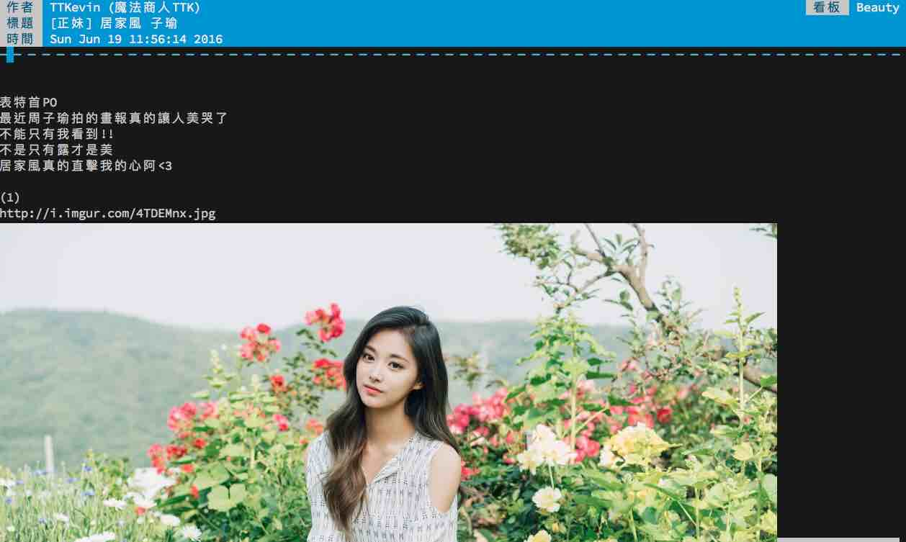

# ptt-autopic
Directly show images on iTerm2 with [imgcat](https://www.iterm2.com/documentation-images.html) when browsing ptt.cc with ssh.

## ScreenShot

## Install
`./install.sh`
## Usage

`ssh bbsu@ptt.cc | ptt-autopic`

You can also make it an alias by adding the following line to your .*rc files.

`alias ssh-ptt-autopic="ssh bbsu@ptt.cc | ptt-autopic"`

then
`ssh-ptt-autopic`.

## Bugs & Todos
- linux support.
- The buffer is not refreshed after a new input.
